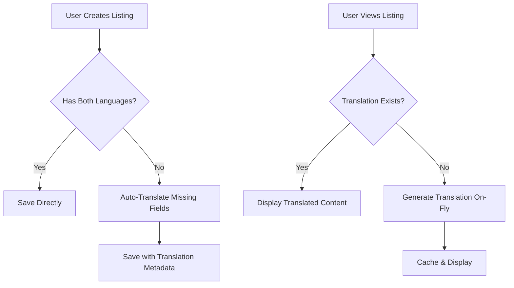

# Nawartu Translation System - Test Guide

## Overview
The Nawartu platform now has a comprehensive automatic translation system that ensures all property listings are displayed in the user's selected language (English or Arabic).

## Key Features

### 1. **Automatic Translation on Creation**
- When hosts create a new listing, they can enter content in just one language
- The system automatically translates missing fields before saving
- A "Auto-translate" button is available for instant translation preview

### 2. **Dynamic Translation on Display**
- All listing content is automatically translated when displayed
- If a translation doesn't exist, it's generated on-the-fly
- Translations are cached in the database for performance

### 3. **Translation Metadata**
- The system tracks which fields were auto-translated
- This helps distinguish between human and machine translations
- Hosts can always override auto-translations manually

## How to Test

### Step 1: Create a Listing with Single Language
1. Go to Create Listing page as a host
2. Enter the listing name only in English (e.g., "Beautiful apartment in Damascus")
3. Leave the Arabic name field empty
4. Click the "Auto-translate" button to see instant translation
5. Submit the form - missing translations will be generated automatically

### Step 2: View in Different Languages
1. Switch the site language to Arabic using the language selector
2. Browse properties - all listings appear in Arabic
3. Switch back to English - all listings appear in English
4. Open any listing details - full content is translated

### Step 3: Edit Existing Listings
1. Go to Edit Listing for any property
2. Clear one language field (e.g., remove Arabic description)
3. Use auto-translate or save directly
4. System fills in missing translations automatically

## Technical Implementation

### Database Schema
```sql
-- Translation metadata fields
name_en_auto_translated BOOLEAN
name_ar_auto_translated BOOLEAN
description_en_auto_translated BOOLEAN
description_ar_auto_translated BOOLEAN
location_en_auto_translated BOOLEAN
location_ar_auto_translated BOOLEAN
last_translation_update TIMESTAMP
```

### Translation Services
- Primary: MyMemory Translation API (better Arabic support)
- Fallback: Google Translate API (free tier)
- Edge Function: `translate-text` handles all translation requests

### Frontend Components Updated
- `PropertyBrowse.tsx` - Auto-translates listings in browse view
- `FeaturedProperties.tsx` - Translates featured listings
- `CreateListing.tsx` - Supports single-language input with auto-translation
- `EditListing.tsx` - Auto-translates when updating listings
- `PropertyCard.tsx` - Displays translated content

## Translation Flow



## Running the Migration Script

To translate all existing listings that are missing translations:

```bash
# Set environment variables
export VITE_SUPABASE_URL=your_supabase_url
export VITE_SUPABASE_ANON_KEY=your_supabase_anon_key

# Run the translation script
npx tsx src/scripts/translateExistingListings.ts
```

## API Usage

### Translation Function
```typescript
import { translateText } from '@/lib/autoTranslation';

// Translate text
const arabicText = await translateText('Hello World', 'ar', 'en');
const englishText = await translateText('مرحبا بالعالم', 'en', 'ar');
```

### Get Translated Content
```typescript
import { getTranslatedContentWithAuto } from '@/lib/autoTranslation';

// Get listing content in user's language
const content = await getTranslatedContentWithAuto(listing, language, true);
// Returns: { name, description, location }
```

## Benefits

1. **User Experience**
   - Users always see content in their preferred language
   - No language barriers when browsing properties
   - Consistent experience across the platform

2. **Host Experience**
   - Hosts can create listings in their native language
   - No need to manually translate everything
   - Can override auto-translations anytime

3. **Performance**
   - Translations are cached in the database
   - On-demand translation for new content
   - Minimal latency impact

## Monitoring

- Check the `last_translation_update` field to see when translations occurred
- Auto-translated fields are marked with boolean flags
- Translation errors fall back gracefully to original text

## Future Enhancements

1. **Translation Quality**
   - Implement translation review system
   - Allow community corrections
   - Use professional translation services for premium listings

2. **Additional Languages**
   - Extend support to more languages
   - Regional dialect support
   - RTL/LTR automatic handling

3. **Smart Caching**
   - Implement Redis caching for frequent translations
   - Batch translation processing
   - Translation versioning